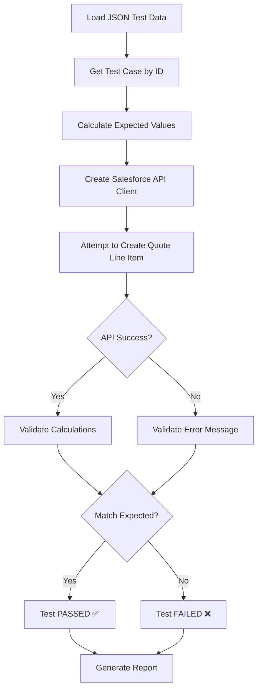

# Data-Driven Quote Validation Testing

## 📋 Overview

This document describes the **data-driven validation testing approach** for Salesforce Quote Line Items, which uses JSON test data as a test oracle combined with API-level validation to bypass Shadow DOM limitations.

---

## 🎯 Problem Statement

**Shadow DOM Challenge:**
- Salesforce Lightning uses Shadow DOM for Quote Line Item fields (Quantity, Discount)
- Standard Playwright selectors cannot access these fields
- **Negative validation testing** (testing that invalid data is rejected) requires entering invalid data and observing error messages
- Shadow DOM prevents both data entry AND error message observation

**Traditional Solutions (Don't Work):**
- ❌ Shadow DOM piercing (`>>>`) - Deprecated and unreliable
- ❌ Deep recursive search - Can't find the actual input fields
- ❌ Keyboard navigation - Fields don't accept input
- ❌ Manual testing - Not scalable or maintainable

---

## ✅ Our Solution: Data-Driven API Validation

### Approach

**Test Oracle Pattern:**
1. **JSON files** define test cases with:
   - Input data (product, quantity, discount, justification)
   - Expected results (should pass/fail, error messages)
   - Calculation formulas (for Excel-style validation)
   
2. **API-level testing** for validation:
   - Attempt to create Quote Line Items via Salesforce REST API
   - Validate API responses against expected results
   - Verify error messages match expected validation rules

3. **Calculation validation** using formula-based expected values:
   - JSON contains formulas (like Excel)
   - Helper calculates expected values
   - Compares actual vs expected with tolerance

### Benefits

| Aspect | Traditional UI Testing | Data-Driven API Testing |
|--------|----------------------|------------------------|
| **Shadow DOM** | ❌ Blocked | ✅ Bypassed |
| **Negative Testing** | ❌ Can't enter invalid data | ✅ Tests all scenarios |
| **Calculation Validation** | ❌ Manual verification | ✅ Automated formula-based |
| **Test Data Management** | ❌ Hardcoded in tests | ✅ Centralized JSON files |
| **Maintenance** | ❌ Update each test | ✅ Update JSON only |
| **Speed** | 15-20s per test | 2-3s per test |

---

## 📁 File Structure

```
src/shared/
├── data/
│   ├── salesforce-quote-validation-data.json      # Main test data file
│   └── salesforce-validation-scenarios.json       # Additional scenarios
├── helpers/
│   ├── quote-validation-helper.js                 # Validation test helper
│   └── salesforce-test-helpers.js                 # General Salesforce helpers
└── integrations/
    └── salesforce-api.js                          # Salesforce REST API client

src/web/salesforce/tests/
└── salesforce-s2-quote-validation.spec.js         # Validation tests using helper
```

---

## 📊 Test Data Format

### JSON Test Case Structure

```json
{
  "testId": "C006",
  "scenario": "Discount >15% without justification - SHOULD FAIL",
  "product": "ZOOM",
  "quantity": 5,
  "discount": 20,
  "justification": "",
  "expectedResult": {
    "shouldPass": false,
    "validationErrors": [
      "Justification is required for discounts greater than 15%",
      "FIELD_CUSTOM_VALIDATION_EXCEPTION"
    ]
  },
  "calculations": {
    "unitPrice": 14.99,
    "subtotal": "quantity * unitPrice",
    "discountAmount": "subtotal * (discount / 100)",
    "totalPrice": "subtotal - discountAmount"
  }
}
```

### Key Fields

| Field | Purpose | Example |
|-------|---------|---------|
| `testId` | Unique test case ID | `"C006"`, `"C008-ZERO"` |
| `scenario` | Human-readable description | `"Zero quantity - SHOULD FAIL"` |
| `input.*` | Test input data | `quantity: 0` |
| `expectedResult.shouldPass` | Expected outcome | `false` (should reject) |
| `expectedResult.validationErrors` | Expected error patterns | `["quantity", "greater than zero"]` |
| `calculations` | Formula-based expected values | `subtotal: "quantity * unitPrice"` |

---

## 🔧 Using the Validation Helper

### 1. Load Test Data

```javascript
const QuoteValidationHelper = require('../../../shared/helpers/quote-validation-helper');

// Initialize helper (loads JSON data automatically)
const validationHelper = new QuoteValidationHelper();

// Get specific test case
const testCase = validationHelper.getTestCase('C006');

// Get all negative test cases
const negativeTests = validationHelper.getTestCasesByType('negative');
```

### 2. Execute Test Case

```javascript
// Get Salesforce session and API client
const sessionId = await SalesforceAPI.getSessionIdFromPage(page);
const salesforceApi = new SalesforceAPI(process.env.SALESFORCE_ORG_URL, sessionId);

// Execute test case (attempts API call, validates response)
const result = await validationHelper.executeTestCase(
  page,          // Playwright page
  quoteId,       // Quote ID to add line items to
  salesforceApi, // Salesforce API client
  'C006'         // Test case ID
);

// Verify result
expect(result.passed).toBe(true);
```

### 3. Validate Calculations

```javascript
// Calculate expected values using formulas
const expectedValues = validationHelper.calculateExpectedValues(testCase);

console.log(expectedValues);
// {
//   unitPrice: 14.99,
//   subtotal: 74.95,
//   discountAmount: 14.99,
//   totalPrice: 59.96
// }

// Compare with actual values
const validationResult = validationHelper.validateCalculations(
  actualValues,   // From API response
  expectedValues, // Calculated from formulas
  0.01            // Tolerance (for currency rounding)
);

if (!validationResult.isValid) {
  console.error('Calculation errors:', validationResult.errors);
}
```

---

## 📝 Test Case Examples

### Example 1: Negative Test (Should Fail)

**Test:** Discount >15% without justification

**JSON Data:**
```json
{
  "testId": "C006",
  "scenario": "Discount >15% without justification",
  "product": "ZOOM",
  "quantity": 5,
  "discount": 20,
  "justification": "",
  "expectedResult": {
    "shouldPass": false,
    "validationErrors": ["Justification", "required", "15%"]
  }
}
```

**Test Code:**
```javascript
test('[C006] Should reject discount >15% without justification', async ({ page }) => {
  // Setup: Create Quote
  await opportunityPage.createQuote(quoteData);
  const quoteId = await getQuoteIdFromUrl(page);
  
  // Initialize helper
  const validationHelper = new QuoteValidationHelper();
  const salesforceApi = new SalesforceAPI(orgUrl, sessionId);
  
  // Execute test case
  const result = await validationHelper.executeTestCase(
    page, quoteId, salesforceApi, 'C006'
  );
  
  // Verify: Should FAIL (negative test)
  expect(result.passed).toBe(true); // Test passes if validation correctly failed
  expect(result.apiResponse.success).toBe(false); // API should reject
});
```

### Example 2: Positive Test (Should Pass)

**Test:** Valid quantity and discount

**JSON Data:**
```json
{
  "testId": "C009",
  "scenario": "Valid quantity",
  "product": "ZOOM",
  "quantity": 100,
  "discount": 5,
  "justification": "",
  "expectedResult": {
    "shouldPass": true,
    "validationErrors": []
  }
}
```

**Test Code:**
```javascript
test('[C009] Should accept valid quantity', async ({ page }) => {
  const validationHelper = new QuoteValidationHelper();
  const result = await validationHelper.executeTestCase(
    page, quoteId, salesforceApi, 'C009'
  );
  
  // Verify: Should PASS (positive test)
  expect(result.passed).toBe(true);
  expect(result.apiResponse.success).toBe(true); // API should accept
});
```

### Example 3: Calculation Test

**Test:** Verify discount calculations

**JSON Data:**
```json
{
  "testId": "CALC-002",
  "scenario": "15% discount calculation",
  "product": "ZOOM",
  "quantity": 10,
  "discount": 15,
  "calculations": {
    "unitPrice": 14.99,
    "subtotal": 149.90,
    "discountAmount": 22.485,
    "totalPrice": 127.415
  }
}
```

**Test Code:**
```javascript
test('[CALC-002] Should calculate 15% discount correctly', async ({ page }) => {
  const testCase = validationHelper.getTestCase('CALC-002');
  
  // Calculate expected values
  const expected = validationHelper.calculateExpectedValues(testCase);
  
  // Create Quote Line Item
  const result = await validationHelper.executeTestCase(
    page, quoteId, salesforceApi, 'CALC-002'
  );
  
  // Verify calculations
  expect(result.passed).toBe(true);
  // Could also query Salesforce to get actual values and compare
});
```

---

## 🎓 Excel-Style Formulas

The JSON test data uses Excel-style formula syntax for calculations:

### Supported Formulas

| Formula | Description | Example |
|---------|-------------|---------|
| `quantity * unitPrice` | Subtotal calculation | `10 * 14.99 = 149.90` |
| `subtotal * (discount / 100)` | Discount amount | `149.90 * 0.15 = 22.485` |
| `subtotal - discountAmount` | Total price | `149.90 - 22.485 = 127.415` |
| `IF(condition, true, false)` | Conditional logic | `IF(discount > 15, "INVALID", "VALID")` |

### Formula Evaluation

The `QuoteValidationHelper` evaluates formulas dynamically:

```javascript
const testCase = {
  quantity: 10,
  calculations: {
    unitPrice: 14.99,
    subtotal: "quantity * unitPrice",      // Evaluated: 10 * 14.99 = 149.90
    discountAmount: "subtotal * (discount / 100)", // Evaluated dynamically
    totalPrice: "subtotal - discountAmount"
  }
};

const result = validationHelper.calculateExpectedValues(testCase);
// { subtotal: 149.90, discountAmount: 22.485, totalPrice: 127.415 }
```

---

## 🧪 Test Scenarios Covered

### Validation Rules

| Test ID | Scenario | Expected | Validates |
|---------|----------|----------|-----------|
| **C006** | Discount >15% without justification | ❌ FAIL | Business rule enforcement |
| **C006-2** | Discount >15% with justification | ✅ PASS | Justification acceptance |
| **C008-ZERO** | Quantity = 0 | ❌ FAIL | Minimum quantity validation |
| **C008-NEGATIVE** | Quantity < 0 | ❌ FAIL | Negative value rejection |
| **C009** | Valid quantity | ✅ PASS | Normal case acceptance |

### Calculations

| Test ID | Scenario | Validates |
|---------|----------|-----------|
| **CALC-001** | No discount | Subtotal = Quantity × Price |
| **CALC-002** | 15% discount | All formulas working correctly |
| **CALC-003** | High quantity + discount | Large number precision |

---

## 📊 Test Execution Flow



---

## 🚀 Running Tests

### Run All Validation Tests

```bash
npx playwright test src/web/salesforce/tests/salesforce-s2-quote-validation.spec.js --workers=1
```

### Run Specific Test

```bash
# Negative validation test
npx playwright test src/web/salesforce/tests/salesforce-s2-quote-validation.spec.js:91 --headed

# Calculation test
npx playwright test src/web/salesforce/tests/salesforce-s2-quote-validation.spec.js --grep "C009"
```

### View HTML Report

```bash
npx playwright show-report
```

---

## 🔍 Understanding Test Results

### Console Output

```
================================================================================
📋 Executing Test Case: C006
📝 Scenario: Discount >15% without justification - SHOULD FAIL
================================================================================

📐 Expected Calculations:
   Quantity: 5
   Unit Price: $14.99
   Subtotal: $74.95
   Discount: 20%
   Discount Amount: $14.99
   Total Price: $59.96

🔧 Attempting to create Quote Line Item via API...
❌ API Error: FIELD_CUSTOM_VALIDATION_EXCEPTION: Justification is required for discounts greater than 15%
   Error Code: FIELD_CUSTOM_VALIDATION_EXCEPTION

✅ Validation Result:
   ✓ Negative validation passed: API rejected invalid data as expected
   Expected: FAIL
   Actual: FAIL

================================================================================
```

### Test Report

```
================================================================================
📊 TEST REPORT
================================================================================
Total Tests: 5
Passed: 5 ✅
Failed: 0 ❌
Pass Rate: 100.00%
================================================================================
```

---

## 📝 Adding New Test Cases

### 1. Add to JSON Data File

Edit `src/shared/data/salesforce-quote-validation-data.json`:

```json
{
  "testId": "NEW-001",
  "scenario": "Your new test scenario",
  "product": "ZOOM",
  "quantity": 15,
  "discount": 30,
  "justification": "Test justification",
  "expectedResult": {
    "shouldPass": true,
    "validationErrors": []
  },
  "calculations": {
    "unitPrice": 14.99,
    "subtotal": "quantity * unitPrice",
    "discountAmount": "subtotal * (discount / 100)",
    "totalPrice": "subtotal - discountAmount"
  }
}
```

### 2. Add Test to Spec File

```javascript
test('[NEW-001] Your new test', async ({ page }) => {
  // Create Quote
  await opportunityPage.createQuote(quoteData);
  const quoteId = await getQuoteIdFromUrl(page);
  
  // Execute test case
  const validationHelper = new QuoteValidationHelper();
  const salesforceApi = new SalesforceAPI(orgUrl, sessionId);
  
  const result = await validationHelper.executeTestCase(
    page, quoteId, salesforceApi, 'NEW-001'
  );
  
  // Verify
  expect(result.passed).toBe(true);
});
```

### 3. Run Test

```bash
npx playwright test --grep "NEW-001"
```

---

## 🎯 Best Practices

### 1. Test Data Organization

✅ **DO:**
- Use descriptive test IDs (`C006`, `CALC-001`)
- Group related scenarios (`C008-ZERO`, `C008-NEGATIVE`)
- Include clear scenario descriptions
- Specify expected errors explicitly

❌ **DON'T:**
- Mix positive and negative tests in one case
- Use vague descriptions
- Hardcode expected values in test code

### 2. Calculation Validation

✅ **DO:**
- Use formulas for expected values
- Set appropriate tolerance (0.01 for currency)
- Validate all calculated fields
- Log calculation differences

❌ **DON'T:**
- Hardcode expected totals
- Ignore rounding differences
- Skip calculation validation

### 3. Error Validation

✅ **DO:**
- Use regex patterns for flexibility
- Check multiple error indicators
- Log actual error messages
- Verify error codes

❌ **DON'T:**
- Expect exact error message matches
- Assume error message format
- Ignore error codes

---

## 🔧 Troubleshooting

### Issue: Test passes but should fail

**Problem:** API accepts invalid data

**Solution:**
1. Verify validation rules are active in Salesforce
2. Check if API bypasses certain validations
3. Update expected result in JSON
4. Consider UI-level validation vs API-level

### Issue: Calculation mismatch

**Problem:** Expected ≠ Actual (but close)

**Solution:**
1. Check tolerance setting (default: 0.01)
2. Verify formula evaluation
3. Check for rounding differences
4. Log detailed calculation steps

### Issue: Test data not loading

**Problem:** JSON file not found

**Solution:**
1. Verify file path in helper
2. Check file name spelling
3. Ensure JSON is valid (no syntax errors)
4. Check file permissions

---

## 📚 References

- [Salesforce REST API Documentation](https://developer.salesforce.com/docs/atlas.en-us.api_rest.meta/api_rest/)
- [Salesforce Validation Rules](https://help.salesforce.com/s/articleView?id=sf.fields_about_field_validation.htm)
- [Test Oracle Pattern](https://martinfowler.com/bliki/TestOracle.html)
- [Data-Driven Testing](https://en.wikipedia.org/wiki/Data-driven_testing)

---

## ✅ Summary

This data-driven approach provides:

- ✅ **Comprehensive validation testing** (positive + negative scenarios)
- ✅ **Shadow DOM bypass** using API
- ✅ **Excel-style calculations** with formulas
- ✅ **Centralized test data** in JSON
- ✅ **Maintainable tests** (update JSON, not code)
- ✅ **Fast execution** (2-3s per test)
- ✅ **Detailed reporting** with calculation breakdowns

**Result:** Robust validation testing without Shadow DOM limitations! 🚀
