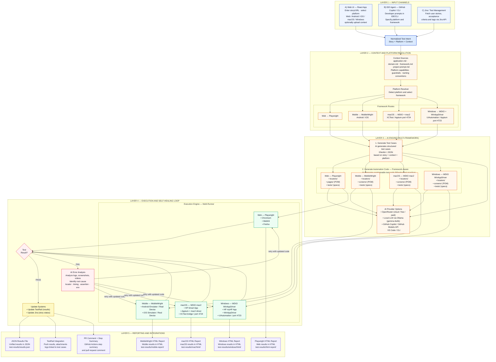

# AI-Assisted Test Automation Framework — Multi-Platform Architecture

This diagram shows how the framework turns plain-English requirements into production-grade automation across **Web, API, iOS, Android, macOS, and Windows** — all orchestrated through GitHub Copilot agents.



---

## Agent → Platform Mapping

| Agent | Platform | Locator Discovery | Config | Context |
|---|---|---|---|---|
| `starhub-automation-agent` | Web + API (Playwright) | Live DOM via Playwright MCP | `playwright.config.js` | `context/ui&api/` |
| `mobile-brownfield-automation-agent` | iOS + Android (MobileWright) | Mobile MCP + device element dump | `mobilewright.config.mjs` | `context/mobile/` |
| `mac-app-agent` | macOS (WDIO + mac2) | Xcode Accessibility Inspector + element dump | `wdio.mac.config.js` | `context/mac/` |
| `windows-app-agent` | Windows (WDIO + WinAppDriver) | windows-app-mcp + Accessibility Insights | `wdio.windows.config.js` | `context/windows/` |

---

## Traceability Flow

```
Plain English AC
       │
       ▼
  Agent reads context/  ──►  discovers real locators from live app
       │
       ▼
  TestRail Case created  ──►  [TC-xxx] embedded in every spec title
       │
       ▼
  3 files generated: locators.js · screen/page.js · spec.js
       │
       ▼
  CI run (GitHub Actions)  ──►  HTML report + Email + PR comment
       │
       ▼
  TestRail pass/fail posted  ──►  full AC → code → result traceability
```

---

## Talk Track

1. Engineers describe what to automate in plain English inside GitHub Copilot Chat — or enter a URL/story in the Workflow UI.
2. They select the agent for the platform — Web, Mobile, macOS, or Windows.
3. The agent loads platform context files, audits existing POM assets, and discovers real locators from the running app.
4. TestRail cases are created automatically and case IDs are embedded in every test title.
5. Three production-ready files are generated: locators, screen/page object, and spec.
6. Tests run in CI on the appropriate GitHub Actions runner — `ubuntu-latest`, `macos-latest`, or `windows-latest`.
7. Results flow back to TestRail, HTML report, email, PR comments, and GitHub step summaries automatically.
8. Failing tests can be repaired by invoking `@playwright-test-healer` with the failure output — the self-healing loop retries automatically.

## Caption

AI-Assisted Test Automation Framework (Web + Mobile + Desktop) — 5-layer architecture covering Web/API via Playwright, iOS/Android via MobileWright, macOS via WDIO+mac2, and Windows via WDIO+WinAppDriver — all driven through GitHub Copilot agents with full TestRail traceability and CI/CD integration.