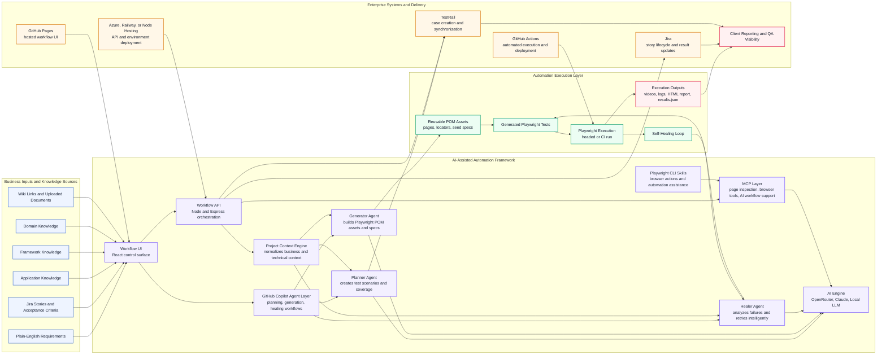

# Client Architecture Diagram

This diagram is designed for client conversations. It shows how the framework turns requirements into maintainable Playwright automation while integrating with Jira, TestRail, AI services, and CI/CD platforms.

## Client Talk Track

1. Business users can start from plain-English requirements or an existing Jira story.
2. The UI captures project context such as application knowledge, framework rules, domain guidance, and supporting documents.
3. GitHub Copilot agent workflows can drive planning, script generation, and healing as part of the broader automation operating model.
4. Playwright CLI skills add browser-operation capabilities for inspection, interaction, and assisted automation flows.
5. The workflow API orchestrates AI agents that plan coverage, generate Playwright automation, inspect live pages, and self-heal failures.
6. Generated assets follow a Page Object Model structure so tests stay maintainable and reusable.
7. Test cases can be synchronized to TestRail, and execution outcomes can be pushed back into Jira.
8. The same framework can run locally or inside GitHub Actions, while the UI and API can be hosted on platforms such as GitHub Pages, Azure, or Railway.

## Suggested Caption

AI-assisted test automation framework that connects requirements, GitHub Copilot agent workflows, Playwright CLI skills, enterprise QA systems, and Playwright execution into a single delivery workflow.